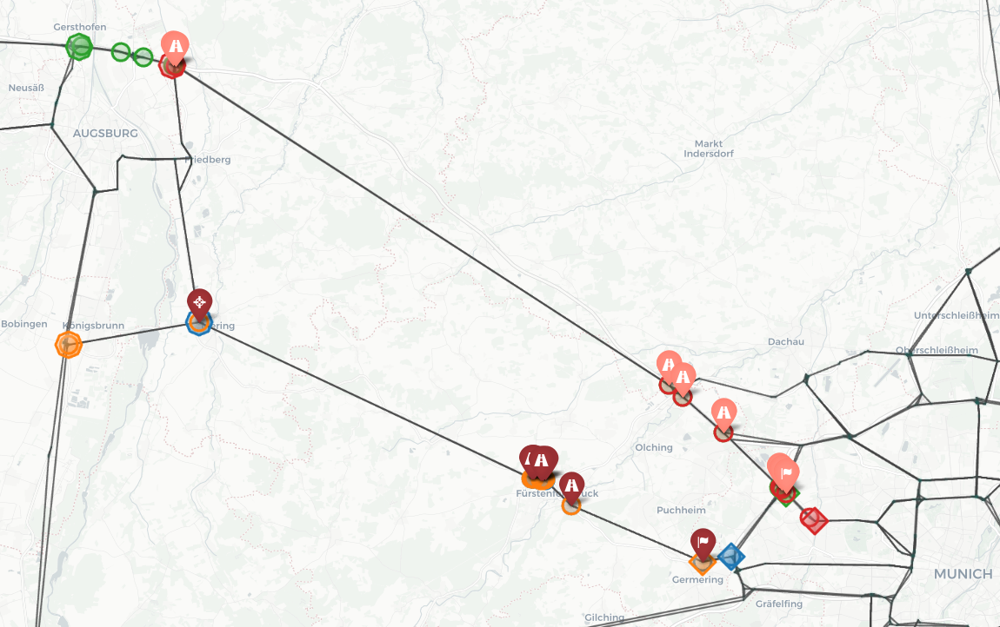

# Platoon Trace Discovery

## Overview

This repository is a fork of [the platooning repository](https://github.com/gb09cl/platooning/) and contains an
experiment for a **platoon trace discovery algorithm** using Neo4j graph databases. It reads vehicle sets, creates
corresponding routes, identifies possible platoons formations on road networks, and visualizes the discovered platoons..

This work is based on the 2021 [paper](https://link.springer.com/chapter/10.1007/978-3-030-89022-3_23):  **"A Conceptual
Modelling Approach for the Discovery and Management of Platoon Routes"** *by Dietrich Steinmetz, Sven Hartmann, & Hui
Ma*.

Key Components:

- **Automated Database Connection**
- **Vehicle Routes Generation**
- **Multiple Experiment Executions**
- **Visualization of the generated traces and routes**

## Requirements

- Python 3.x (tested with Python 3.9.7)
- Docker (tested with Docker Desktop for Mac)
- Docker Neo4j Image (tested with version 3.5.2-enterprise (AMD64)).

## Installation

Please consider the directory `/exp2` to be the execution root for all operations after cloning.

1. **Clone the Repository:**

   Using HTTPS:

   ```bash
   git clone https://github.com/neto-1/platoon_traceDiscovery.git
   cd platoon_traceDiscovery
   ```

   Or using SSH:

   ```bash
   git clone https://github.com/neto-1/platoon_traceDiscovery.git
   cd platoon_traceDiscovery
   ```

   - Inside this folder,  create a new folder called ``data`` and add then ``database.spatial`` database here.
   ```
   mkdir data
   ```
   **NOTE** Please get access to the ``database.spatial`` database by simply sending an email to any platoon team member. For storage reasons, this could be push to the github repo.

2. **Install Docker and Neo4j Docker Image (3.5.2-enterprise):**

    - Install Docker based on your OS from: https://docs.docker.com/engine/install/


3. **Install Python Dependencies:**

   Ensure you have Python 3.x installed. Optional: use a virtual environment.

   - Install packages from requirements.txt if this is present or else, install them manually after runing "python run.py"
   ```bash
   pip install -r /exp2/requirements.txt
   ```
   Please manually check the packages as the automatic package installing has not been tested.

4. **Configure Neo4j Credentials & Database paths:**

   - The code has been optimised so that least manual configurations are required. 

   Specify a road network in `configuration.py` which you would like to be loaded from the database. A separate Docker
   container will be used per road network:
   ```python
   db_road_networks = [("bayern", 50*1000, 1500*1000)]  # Example configuration
   ```
   **Important Note**: Vehicle configurations in `experiment.json` are closely linked to the `db_road_networks`
   specified in `configuration.py`. Each vehicle set is designed for a specific road network (e.g., Bavarian map), with
   start and destination nodes corresponding to local node IDs in that network. Using a vehicle configuration from one
   road network on a different network (e.g., Swedish or custom grid) **will not work**. Always ensure the vehicle sets
   in `experiment.json` align with the road network defined in `configuration.py`.


5. **Configure experiment parameters:**

   Update `config/experiment.json` with your experiment details. The only relevant parameter for the trace discovery
   problem is `custom_nodes`:

   - Runnin the experiment with custom vehicles:
   ```json
       "data_parameters": {
           "number_of_different_exp": 1,
           "vehicle_sets_info": {
               "custom_nodes": [
                   "bay_10"
               ]
           }
       },
   ```

   - Runnin the experiment with random vehicles:
   ```json
       "data_parameters": {
            "number_of_different_exp": 1,
            "vehicle_sets_info": {
               "distributions": {
               "number_of_vehicles": [
               7
            ],
            "methods": [
               "random"
            ],
            "requirements": [
               "standard"
            ]
            }
         }
      },
   ```

   **Vehicle nodes** are stored in `exp2/config/vehicles/`. Each file contains a list of source and destination nodes
   for `m` vehicles in a road network `rn` and are often named `rn_n`. For example, `bay_50` lists 50 vehicles with
   starting and ending nodes that exist in the `bayern` road network (reminder: road networks should be chosen
   in `configuration.py`).

   Example of a vehicle cofiguration:
   ```json
   { 
      "vehicles": [[235828, 251613], [72417, 183217], [172439, 183217]]
   }
   ```
6. **Optional: For Apple Silicon Users**:

   This has been already handled for you in `exp2/util/databasecontainer.py`, but please note that when launching a
   docker container that uses an older Neo4j image, you should add the following flag to specify the target platform:
   ```python
   --platform linux/x86_64 neo4j:{db_version}
   ```
   in the `docker run --param_1 --param_2 --param_n` command. For non-Apple users, in case you face unexpected issues,
   you may remove this flag .

## Running the Project

1. **Run the Full Experiment:**

   The main script `batch/run.py` is responsible for setting up the Neo4j database (automatically starting the Docker
   container if needed), preparing the vehicles and their routes, and running the test suite.

   - At the parent directory: `platoon_traceDiscovery`, run
   ```bash
   cd src/exp2/batch
   python3 run.py
   ```

   *Note:* Ensure Docker Daemon is running.

2. **Test Case Execution Example Output:**

   Note: The actual output is more colorful ; )
    ```
    =================================== Initialization and Bootstrap ===================================
    2024-09-23 18:43:37,538 - INFO - Container "neo_bayern" is already running.
    2024-09-23 18:43:38,518 - INFO - Neo4j database inside the container is now fully operational and ready to accept connections. Startup completed in 0.98 seconds.
    2024-09-23 18:43:38,518 - INFO - Access the Neo4j browser interface at: http://localhost:7474/browser/


    ================================ Vehicle Loading and Route Creation ================================
    2024-09-23 18:43:38,520 - INFO -  As per the "vehicle_sets_info=bay_10" parameter in "experiment.json", 10 vehicle(s) and their RouteNodes, will be created into a new vehicle set.
    2024-09-23 18:43:40,211 - INFO - Created 63 :RouteNodes for :Vehicle (<id>=549181).
    2024-09-23 18:43:40,381 - INFO - Created 39 :RouteNodes for :Vehicle (<id>=549245).
    2024-09-23 18:43:40,422 - INFO - Created 13 :RouteNodes for :Vehicle (<id>=549285).
    2024-09-23 18:43:40,560 - INFO - Created 44 :RouteNodes for :Vehicle (<id>=549299).
    2024-09-23 18:43:40,646 - INFO - Created 30 :RouteNodes for :Vehicle (<id>=549344).
    2024-09-23 18:43:40,809 - INFO - Created 64 :RouteNodes for :Vehicle (<id>=549375).
    2024-09-23 18:43:40,945 - INFO - Created 40 :RouteNodes for :Vehicle (<id>=549440).
    2024-09-23 18:43:41,069 - INFO - Created 57 :RouteNodes for :Vehicle (<id>=549481).
    2024-09-23 18:43:41,220 - INFO - Created 45 :RouteNodes for :Vehicle (<id>=549539).
    2024-09-23 18:43:41,368 - INFO - Created 49 :RouteNodes for :Vehicle (<id>=549585).
    2024-09-23 18:43:41,543 - INFO - Created 10 vehicle(s) in a :VehicleSet (<id>=549180) in 2.744908 seconds.
    2024-09-23 18:43:41,544 - INFO - Completed vehicle generations for "bay_10".
    2024-09-23 18:43:41,544 - INFO - All vehicle sets specified in "experiment.json" have been created successfully.
    ======================================= Test Cases Execution =======================================
    2024-09-23 18:43:41,544 - INFO - Started running the test suite with 1 test case(s)
    +++++++++++++++++++++++++++++ Executing test case 1 out of 1 ++++++++++++++++++++++++++++++
    2024-09-23 18:43:42,389 - INFO - Initiating :Platoon discovery for the 10 vehicles in :VehicleSet (<id>=549180).
    2024-09-23 18:43:42,912 - INFO - Finished discovering :Platoons for :VehicleSet (<id>=549180)
    2024-09-23 18:43:42,912 - INFO - Generated 6 platoon trace(s) for :VehicleSet (<id>=549180): {549635, 549640, 549772, 549709, 549659, 549662}
    Traces details:
            Trace 549709 has 45 events.
            Trace 549772 has 44 events.
            Trace 549662 has 24 events.
            Trace 549640 has 10 events.
            Trace 549635 has 3 events.
            Trace 549659 has 2 events.

    VISUALIZATION HINT: To visualize the generated platoon traces for this test case, run the following command:
    (First, please cd into the correct directory. It should be /exp2/algorithms/trace_discovery/map_visualization/)
    python3 visualizer.py --vehicle_set_id 549180 --platoon_ids 549635 549640 549772 549709 549659 549662


    2024-09-23 18:43:42,913 - INFO - Finished executing all the tests in the test suite.
    ```

3. **Generate Visualizations:**

   Please note the *already-prepared **visualization command*** at the end of each test case execution in the log above.

   Navigate to the visualization directory and run:

   ```bash
   cd exp2/algorithms/trace_discovery/map_visualization/
   python3 visualizer.py --vehicle_set_id <vehicle_set_id> --platoon_ids <platoon_id_1> <platoon_id_2> ...
   ```

   Replace `<vehicle_set_id>` and `<platoon_id_1> <platoon_id_2> ...` with the actual IDs output from the test case
   execution.

   Note: After the execution of the visualization script, a local path to a generated HTML map is printed out. This can
   be copied out into a web browser to view the visualization. Really large files (100+ vehicles/large maps) can be
   extremely slow.

   Example of the script output:
   ```
   2024-09-23 19:19:20,689 - INFO - Fetching road segments and nodes.
   2024-09-23 19:19:23,030 - INFO - Fetched vehicle routes for Vehicle Set (ID=548538).
   2024-09-23 19:19:23,055 - INFO - Fetched platoon events for 2 platoons.
   2024-09-23 19:19:23,055 - INFO - Generating map.
   2024-09-23 19:19:23,055 - INFO - Creating map centered at [48.6384555, 11.5582801].
   2024-09-23 19:19:23,059 - INFO - Plotting road segments.
   2024-09-23 19:19:23,512 - INFO - Plotting nodes.
   2024-09-23 19:19:23,881 - INFO - Plotting vehicle routes.
   2024-09-23 19:19:23,884 - INFO - Plotting 2 platoon events.
   ========================================== Ready to view ===========================================
   2024-09-23 19:19:31,565 - INFO - Map has been created and saved as 
   /Users/aghiadhaloul/repos/graphdbs/platooning/src/exp2/algorithms/trace_discovery/map_visualization/vehicle_set_548538_platoon_count_2_20240923_191923.html
   HINT: copy the local path above into your browser.
   ====================================================================================================
   2024-09-23 19:19:31,566 - INFO - Data export process completed successfully.
   ```
   
   #### Figure: Screenshot of a generated HTML map

## Main Relevant Files

- `batch/run.py`: Main script to run the experiment.
- `util/databasecontainer.py`: Handles the starting and stopping of the Neo4j Docker container.
- `model/testsuite.py`: Defines and runs the test suite.
- `model/testcase.py`: Executes individual test cases.
- `algorithms/trace_discovery/algorithm.py and /database.py`: Implements the platoon trace discovery algorithm.
- `configuration.py`: Configuration file for database settings and experiment parameters.
- `experiment.json`: Defines the experimental setup, including vehicle sets and test parameters.
- `config/vehicles`: Contains input to the experiment in the form of vehicle sources and destinations.

## Troubleshooting

- **Neo4j Connection Issues:**

    - Ensure Docker Daemon (aka Desktop app / terminal) is running.
    - Verify that ports `7474` (HTTP) and `7687` (Bolt) are not in use by other applications **or by currently running
      Docker images**
    - Check that the `NEO4J_AUTH` credentials match those in `configuration.py`.

- **Docker Daemon Errors:**

    - If the Docker daemon is not running, start it before running the experiment.
    - For port conflicts, either stop the conflicting application or change the port settings in `configuration.py`.
    - Add `--platform linux/x86_64 neo4j:{db_version}` flag to your docker run command, if your system requires it.

- **Python Module Errors:**

    - Ensure all required Python packages are installed.
    - If `requirements.txt` did not work, manually install dependencies using pip. (tested on version from Q1.2024).

## Legal Disclaimer

This source code is provided as part of a Master's thesis at the Technical University of Clausthal, Germany, in 2024,
and is based on code provided by the Big Data and Technical Information Systems research group at the Institute for
Informatics. The code is distributed strictly for academic purposes, and no warranty is provided regarding its use or
the results it produces. The user assumes full responsibility for verifying its suitability and correctness for any
application.

Permission to use this code is granted for educational or research purposes. Redistribution or commercial use without
consent from the author(s) and the relevant research group is prohibited.